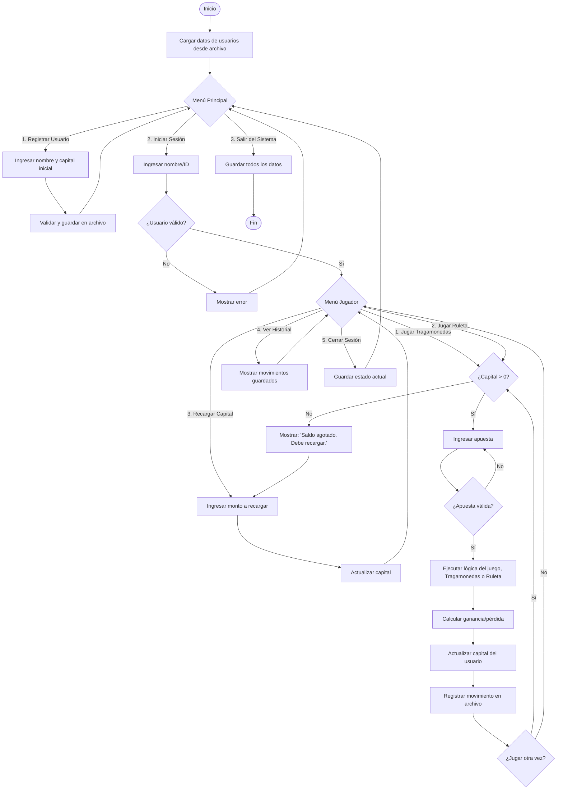

Universidad Nacional de Colombia

Ingeniería de sistemas

Semestre 2026-1

Programación básica

Propuesta proyecto final programación

Nombre: Mini casino

Integrantes

* Santiago Esteban Castelblanco Castiblanco: [scastelblancoc@unal.edu.co](mailto:scastelblancoc@unal.edu.co)  
* Matthew Nielsen Guequeta: [mnielsen@unal.edu.co](mailto:mnielsen@unal.edu.co)   
* Juan Manuel Russi Martinez: [jrussim@unal.edu.co](mailto:jrussim@unal.edu.co) 

Descripción  
Se busca realizar una plataforma tipo casino, con término “mini” debido a que solo se presentarán dos juegos, específicamente: tragamonedas y ruleta, con ganancia, pérdidas y registros de x jugador

Objetivo general  
Realizar un sistema básico de casino donde se registre el nombre del integrante y el capital inicial, por medio de dos juegos puede aumentar o disminuir dicho capital, si el usuario pierde todo el capital, deberá realizar “ingreso” de nuevo capital para continuar jugando

Objetivos específicos

1. Desarrollar un sistema básico de registro de usuarios que permite crear y mantener registro de cada usuario registrado  
2. Entender y adaptar el funcionamiento de cada uno de los juegos presentes en el sistema y la interacción usuario-sistema, en los posibles casos de uso del mismo (validación de apuesta, resultado, cálculo de ganancia/pérdida, etc)  
3. Comprender y aplicar los fundamentos de programación en C++ (estructuras de control, funciones, validación de entradas y manejo de archivos) para estructurar el código de manera modular, legible y con persistencia de datos

Funcionalidades principales:

* Gestión de usuarios: Registro y eliminación de jugador, inicio de sesión, consulta de datos.  
* Control de capital: Asignación inicial, validación usuario-sistema (ganancia, pérdida, apuesta no sea mayor al capital), recarga cuando se llegue a cero  
* Tragamonedas: Generación de símbolos, calculo de premios, y visualización de resultados y proceso en la consola  
* Ruleta: Opciones de apuesta (número, color, paridad, rangos), simulación de giro con visualización relativa en consola, determinación de ganador y pago  
* Persistencia: Almacenamiento local en archivos de texto, de los posibles datos como los usuarios y capital, historial de jugadas.  
* Manejo de errores: Validación ingreso adecuado, control números negativos, control de variables y finalización adecuada del programa

Diagrama de flujo:  

